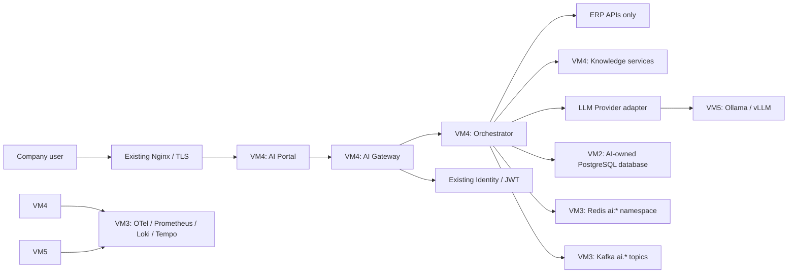

# CHIOTRON Enterprise AI Platform Architecture v1

Status: **proposed - approval required before production implementation**

## 1. Scope and principles

The Enterprise AI Platform is a separately deployable intelligence and orchestration layer. ERP remains the system of record. The platform never directly changes ERP data and an AI outage must not affect ERP business operations.

| Boundary | Owner | Responsibility | Explicitly excluded |
|---|---|---|---|
| ERP platform | Existing ERP services | Business rules and writes | AI orchestration |
| VM4 Control Plane | AI Platform | Portal, gateway, orchestration, RAG, policy, audit | GPU inference |
| VM5 Compute Plane | AI Platform | Model and embedding inference | ERP business logic and public access |
| VM2 / VM3 shared services | Existing platform | PostgreSQL infrastructure, Kafka, Redis, observability, identity | AI domain ownership |

## 2. Infrastructure and network



### Network policy

- Only Nginx exposes the portal and gateway. Browser traffic terminates at VM4.
- VM5 accepts inference traffic only from VM4 over a private network. It has no public ingress and no published model-provider port.
- VM4 calls ERP through its authorized APIs. ERP does not call VM5.
- Model downloads use a controlled VM5 egress route. Production ingress and egress policy is firewall-managed, not compose-managed.
- `X-Active-Company` is accepted only after JWT validation and is checked against the identity claims on every request.

## 3. Deployable services

| Service | Plane | Data ownership | Scale independently | Initial implementation |
|---|---|---|---|---|
| AI Portal | VM4 | none | Yes | React 19, Vite, React Router, React Query |
| AI Gateway | VM4 | API keys, usage/audit outbox | Yes | Go HTTP/SSE gateway |
| Orchestrator | VM4 | policies and conversation metadata | Yes | Go service |
| Knowledge service | VM4 | source, document, chunk, ACL metadata | Yes | worker/API, pgvector first |
| Tool/MCP service | VM4 | tool registry and execution audit | Yes | controlled client adapters |
| SQL service | VM4 | approved semantic model and query audit | Yes | read-only ERP data adapter |
| Compute adapter | VM4 | model registry/routing policy | Yes | provider-neutral client |
| Compute runtime | VM5 | loaded model cache only | Yes | Ollama initially, vLLM/NIM later |

Services communicate synchronously by REST/gRPC where an immediate answer is needed and asynchronously via Kafka for ingestion, usage, audit fan-out and long-running work. Every consumer is idempotent and topics are versioned.

## 4. Provider boundaries

Business services depend on interfaces, never a vendor SDK:

```text
LLMProvider        -> OllamaAdapter | VLLMAdapter | NIMAdapter | ExternalAPIAdapter
EmbeddingProvider  -> OllamaEmbeddingAdapter | future remote adapters
VectorStoreProvider -> PgvectorAdapter | QdrantAdapter | MilvusAdapter
GraphProvider      -> PostgresGraphAdapter | Neo4jAdapter
SearchProvider     -> PostgresHybridSearchAdapter | future OpenSearchAdapter
StorageProvider    -> LocalAdapter | NASAdapter | S3Adapter | MinIOAdapter
MessageQueueProvider-> KafkaAdapter
VisionProvider / SpeechProvider -> provider-specific adapters
```

The model registry stores logical model identifiers and capabilities. Routing policies select a provider endpoint; model names and provider URLs are configuration, not application constants.

## 5. Security model

- Existing Identity issues JWTs; the gateway validates issuer, audience, signature, expiry, roles, scopes, company and active-company entitlement.
- RBAC controls feature/action permissions. ABAC adds company, department, classification, ownership and assistant policy conditions.
- The backend authorizes every assistant, agent, tool, MCP, knowledge, SQL and export action. UI filtering is convenience only.
- API keys are hashed, scoped, rate-limited, expirable and auditable. Raw values are shown once only.
- Conversation retention, prompt logging and audit metadata are configurable. Sensitive document content is minimized in logs.
- Text-to-SQL uses a separate read-only account, an allowlisted semantic schema, mandatory company constraints, timeout/result caps and a parser-based deny policy for write/DDL operations.

## 6. Knowledge Intelligence Platform

1. A connector extracts a source and saves it through `StorageProvider`.
2. The ingestion worker normalizes, chunks, classifies and stores source ACL metadata with every chunk.
3. Embedding is requested through `EmbeddingProvider`; vectors live in pgvector initially.
4. Retrieval applies identity/company/department/classification predicates before hybrid keyword/vector ranking.
5. The orchestrator may run follow-up searches, relationship traversal or approved tools, then returns citations and a policy-filtered answer.

GraphRAG begins with AI-owned `graph_nodes` and `graph_edges` tables to avoid premature infrastructure. A `GraphProvider` supports migration to Neo4j without changing orchestration logic.

## 7. API and event contracts

| Interface | Responsibility |
|---|---|
| `POST /api/v1/chat/completions` | Authenticated, streaming assistant response via AI Gateway |
| `GET /api/v1/assistants` | Permission-filtered assistant catalogue |
| `POST /api/v1/documents` | Authorized upload initiation; source ACL metadata required |
| `POST /api/v1/sql/execute` | Permissioned, read-only, validated analytic query only |
| `GET /api/v1/admin/*` | Admin capability, role and policy management |
| `GET /healthz`, `/readyz`, `/metrics` | Liveness, dependency readiness and observability |

Kafka topics: `ai.inference.request.v1`, `ai.inference.completed.v1`, `ai.agent.execution.v1`, `ai.tool.execution.v1`, `ai.mcp.execution.v1`, `ai.knowledge.ingestion.v1`, `ai.embedding.request.v1`, `ai.usage.v1`, and `ai.audit.v1`.

Redis key prefixes: `ai:session:*`, `ai:cache:*`, `ai:rate-limit:*`, `ai:agent:*`, and `ai:job:*`. Retention and TTLs are policy settings.

## 8. AI-owned database boundaries

Initial AI database/schema contains assistants, assistant policies, model registry, agents, tools, API keys, conversations, messages, knowledge sources, documents, chunks, embeddings, graph nodes/edges, SQL query audit, tool calls, usage, audit logs and configuration. Records use company and tenant context where applicable, `deleted_at` for soft deletion, and partial indexes such as `WHERE deleted_at IS NULL` for high-volume queries.

This database is separate from ERP service databases even when operated by the same VM2 PostgreSQL cluster.

## 9. Observability, backup and DR

- VM4 and VM5 emit OpenTelemetry traces and structured logs to the existing Tempo/Loki stack.
- Prometheus scrapes gateway, worker and GPU metrics; dashboards cover requests, latency, tokens, tool calls, RAG/SQL execution, cache behaviour, GPU/VRAM and errors.
- AI PostgreSQL uses the existing backup and replication policy, with point-in-time recovery tested separately from ERP restoration.
- Documents use versioned object storage backups. Model cache is rebuildable and is not the source of record.
- VM5 loss degrades AI model calls only; VM4 reports provider unavailable. VM4/Node 4 loss never blocks ERP operations.

## 10. UI architecture

One portal has Home, New Chat, History, Assistants, Documents, Search, Favorites, Shared Chats and Settings. Chat, Analyze, Create, Search and ERP are workspaces within the same application. Assistant-first selection hides provider details.

All user-visible strings use `t(key)` for Thai, English, Chinese, Burmese and Japanese. Pages use the central layout, `themeConfig`, `SearchableSelect`, React Query, shared modal components and permission-aware navigation. Tables use loading/sorting/column-selection/trash/pagination components; dates use `formatDate(date, i18n.language)`.

## 11. Deployment target

Production uses two compose deployments:

- **VM4 compose:** portal, gateway, orchestrator, knowledge/worker services. It connects to existing Identity, PostgreSQL/PgBouncer, Redis, Kafka, Nginx and observability through environment-supplied endpoints.
- **VM5 compose:** compute runtimes only, with NVIDIA Container Toolkit, a private VM4 allowlist, controlled egress and persistent model cache.

The current single-host compose is a development-only topology. It must not be promoted to VM4/VM5 production deployment.

## 12. Phased delivery

1. Foundation: identity integration, configuration, database migrations, API contracts, OTel and CI checks.
2. Gateway: JWT/API keys, quotas, streaming and usage/audit outbox.
3. Portal: workspace shell, assistants, chat/history and i18n.
4. Local LLM: provider registry, Ollama adapter and compute health/routing.
5. Knowledge: connectors, document ACL, ingestion, embedding and hybrid retrieval.
6. Agentic RAG: planner, controlled agents/tools and citation UI.
7. GraphRAG: graph projection/traversal and provider abstraction.
8. Text-to-SQL: semantic allowlists, validator, read-only account and audit.
9. MCP: registry, permissioned client and tool governance.
10. ERP integration: authorized read APIs and write workflow adapters.
11. Observability and capacity testing.
12. Multi-compute routing, HA and Kubernetes migration.

## 13. Risks and decisions requiring approval

1. VM4 and VM5 IP ranges, firewall rules and TLS/mTLS ownership.
2. Existing Identity JWT issuer/audience/JWKS and AI permission claim contract.
3. AI database name, PgBouncer route, backup retention and company/tenant schema strategy.
4. Kafka ACL principal, topic retention and schema registry policy.
5. Storage provider of record and document classification/retention policy.
6. ERP APIs available for each intended AI capability and the read-only analytics boundary.
7. GPU capacity: the local Quadro P620 has 2 GB VRAM and is adequate only for development smoke tests, not enterprise model capacity.
